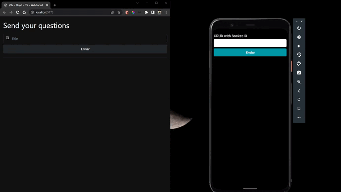

# CRUD on real time - mobile



> ⚠️ The backend is needed to reproduce the project. Clone it [here](https://github.com/KollerZx/crud-websockets)

## 👷 Motivation
Create a real-time list on react native to help others developers who need to implement in their projects web socket. Other implementation is on [web](https://github.com/LeandroGCruzP/crud-websockets-client-web)

## 🔧 Tools
Tools | Version
----- | -------
[Expo](https://docs.expo.dev/) | 45.0.0
[React Native](https://reactnative.dev/docs/getting-started) | 0.68.2
[Socket IO Client](https://socket.io/docs/v4/client-api/) | 4.5.1

## 👥 Clone this repository
First, clone this repository with HTTPS
```bash
git clone https://github.com/LeandroGCruzP/crud-websockets-client-mobile.git
```

or with SSH

```bash
git clone git@github.com:LeandroGCruzP/crud-websockets-client-mobile.git
```

After, install dependencies of the project

```bash
cd crud-websockets-client-mobile
```

```bash
yarn
```

To start the project it's necessary [install the expo](https://docs.expo.dev/get-started/installation/) on your local machine and execute
```bash
expo start
```

### 😀 For more projects see my [Github](https://github.com/leandrogcruzp) or contact me on on [Linkedin](https://www.linkedin.com/in/leandrogcruzp/) or [Instagram](https://www.instagram.com/lea_gcruz/)

